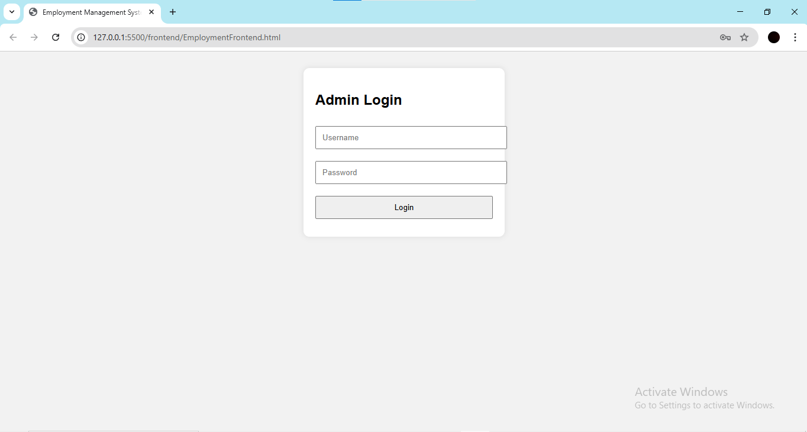
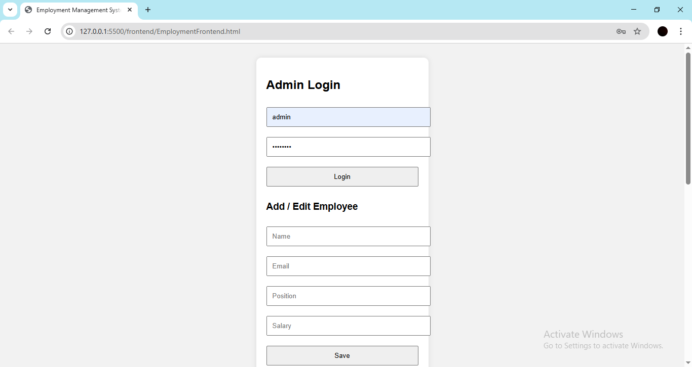
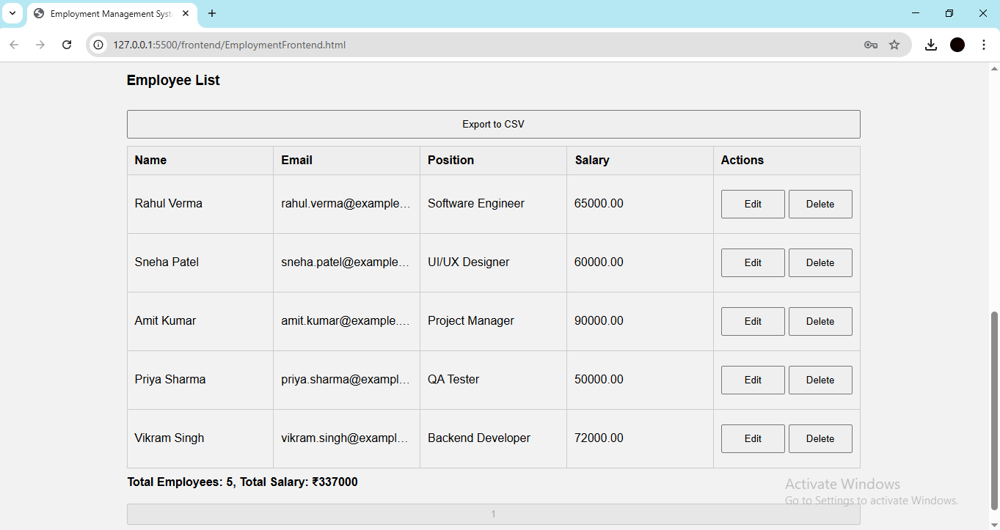

# Employment Management System

A Full-Stack Employment Management System developed as part of the **PRODIGY_FS_02** project. This application allows administrators to manage employee records through a user-friendly interface with support for CRUD operations, pagination, search, and CSV export functionality.

## 🔧 Tech Stack

- **Frontend:** HTML, CSS, JavaScript
- **Backend:** Node.js, Express.js
- **Database:** MySQL
- **Version Control:** Git & GitHub

## 💡 Features

- 🚀 Add, edit, and delete employee details
- 🔍 Search employees by name
- 📄 Export employee records to CSV
- 📊 Total employee count and salary display
- 📚 Pagination (5 entries per page)
- 🧠 Backend validation and routing
- 🔐 Basic authentication (optional extension)

## 📷 Screenshots

### Admin Login


### Add Employees


### Employee List with Pagination and Search



## 📁 Project Structure
```
Employment_Management_System/
├── frontend/
│ └── EmploymentFrontend.html
├── node_modules/
├── routes/
│ └── authRoutes.js
│ └── employeeRoutes.js
├── screenshots/
│ └── admin_login.png
│ └── add_employees.png
│ └── employee_list.png
├── .env
├── createAdmin.js
├── db.js
├── LICENSE
├── package.json
├── package-lock.json
├── README.MD
├── server.js
```

## 🛠️ How to Run Locally

1. **Clone the repo**
   ```
   git clone https://github.com/Asish7980/PRODIGY_FS_02.git
   cd PRODIGY_FS_02
   ```
2.  **Install dependencies**
```
npm install
```
3.  **Configure MySQL**

Update ```db.js``` with your MySQL credentials.

Create a database named ```employment_db``` and import required tables.

Run the server
```
node server.js
```
Open in Browser
Visit: http://localhost:3000

### ⚙️ Requirements
Node.js

MySQL

Git

### 📦 Exporting Data
Click the Export CSV button in the UI to download employee data as a .csv file.

### 📌 Pagination & Search
Pagination: Displays 5 records per page

Search: Instantly filter employees by name

### 📑 License
This project is open-source and available under the MIT License.

### by Asish
